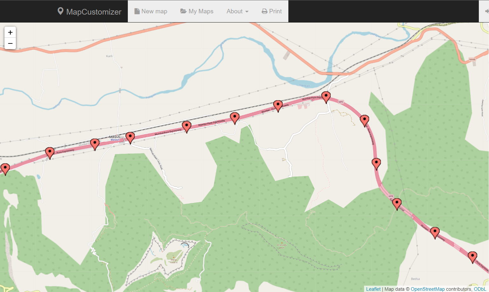
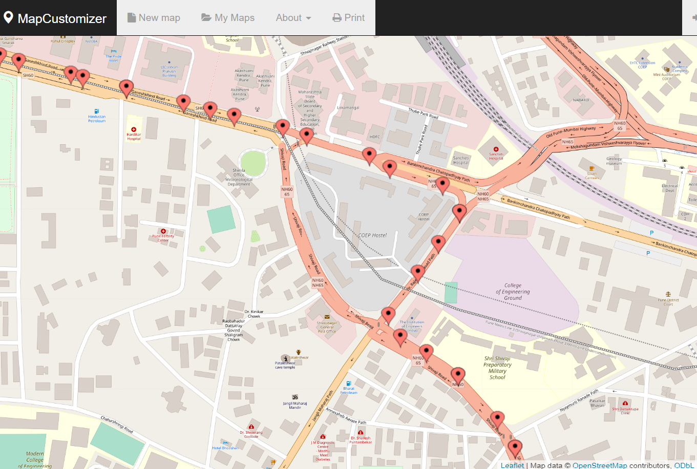
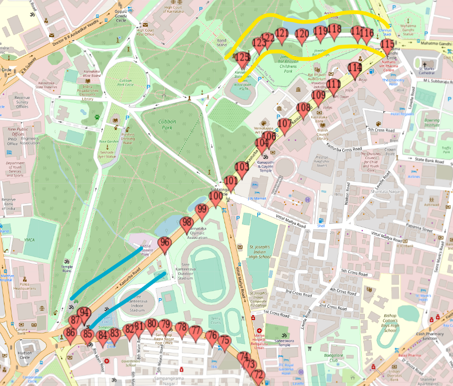

# README

This application is used find nearly equidistant markers on the road for directions between a source and destination.
Built to be used for tracking progress of any thing that is in-transit on a particular route. 

### 1. How to run the code
0. Requirements : Java11, Maven
1. unzip and cd into folder `map-point-plotter`
2. (OPTIONAL) following properties can be modified before building and running [application.properties](src/main/resources/application.properties) 
    1. `api.key` - API_KEY for accessing DirectionsAPI
    2. `logging.level.com.loctest` - set this to DEBUG to view how to points are added
3. `mvn clean install`
4. `java -jar target/map-point-plotter-0.0.1-SNAPSHOT.jar`

   
### 2. Sample request and response.

1. [samplerequest.txt](src/main/resources/samplerequest.txt) 
2. [sampleresponse.txt](src/main/resources/sampleresponse.txt) JSON response is returned to the REST call, **however its easier to use plain-text from the console output**
3. responses can be visualized on this tool: [MapCustomizer](https://www.mapcustomizer.com/) > Bulk Entry ( [Example Plot Using This Code](https://www.mapcustomizer.com/map/linesandcurves)
3. 
4. 
   

### 3. Explaination of the code structure 

This is a Springboot application that uses Google Maps Direction API to fetch routes from origin to destination.
REST Endpoint is exposed to consume the origin and destination which is used to query Google's DirectionAPI and the results are processed to return relavant points across the route.

The Points on the paths are processed according to the following logic:

1. DirectionAPI provides different ROUTES (different paths that can be taken) between the two points, here we have chosen the route with minimum distance between the the points. (`getStepsFromShortestRoute()`)
2. Each route has one or more LEGS (stretch in the ROUTES), which have one or more STEPS (change in direction). Steps are the actual points on the map that have coordinates and directions which when followed sequentially will lead us from origin to the destination.  
3. The steps have definite start and end points, which **may or may not be 50m apart**. 
4. According to the problem statement, we need to find the coordinates of intermediate points which are less than equal to 50m (if DirectionSteps are longer than 50m - we need to calculate intermediate points that lie on the path).
5. Ideal Solution would be to calculate intermediate points using coordinate geometry and then snap the location of these points on the road by the help of Google's [RoadAPI](https://developers.google.com/maps/documentation/roads/snap) which Snaps the list of points to a standard road route.
6. However, we are only going to use DirectionsAPI, **we can leverage the PolyLine Encoding of the path that is available for each DirectionStep in the response. This is viable for short stretches of Steps only, because PolyLine Encoding is a Lossy Encoding of the path. (it is intended for visualization of path on a normal scale resolution)**
7. The list of coordinates are selected according to the following logic:
    1. For Each DirectionsStep in Leg of Route:
    2. Start of the  DirectionsStep is added as a Point
    3. If( Distance between Start and End of the DirectionStep ) > `INTER_POINT_DISTANCE` (where `INTER_POINT_DISTANCE=50`meters)
        1. All Points between Start and End of this DirectionStep are added to a Map (CoordinatePoint, DistanceFromStartOfStep) - this is our QuartileMap that has the distribution of distance for each Point (like a percentage of completion of path from the start point) 
        2. Number of Points (`totalCoordinatesNeededInStep`) needed in this step are calculated based on (Length Of DirectionStep)/`INTER_POINT_DISTANCE` 
        3. We fetch the `totalCoordinatesNeededInStep` Points from the previously created QuartileMap based on their quartile position and add these to the list of points in the path.
    4. Add the Destination Point at the end of all steps
8. The list is returned as a JSON response 

### Polyline Encoding features:

There are a few things that make polyline encoding interesting. 
The following is an output of the points that are encoded in the polyline for this route. We can draw two conclusions from this example:
1. The Blue line segment - has low density of points
2. The Yellow line segment - has high density of points

   
